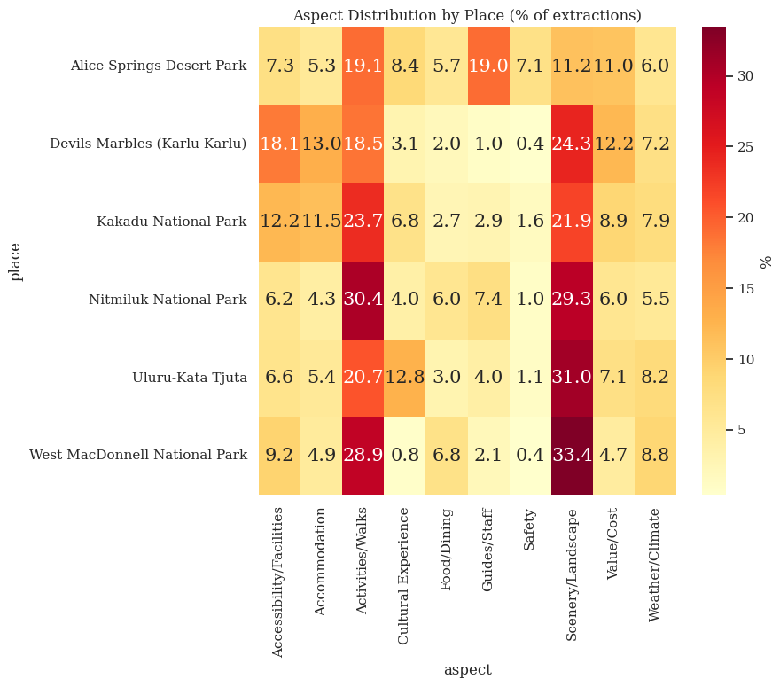
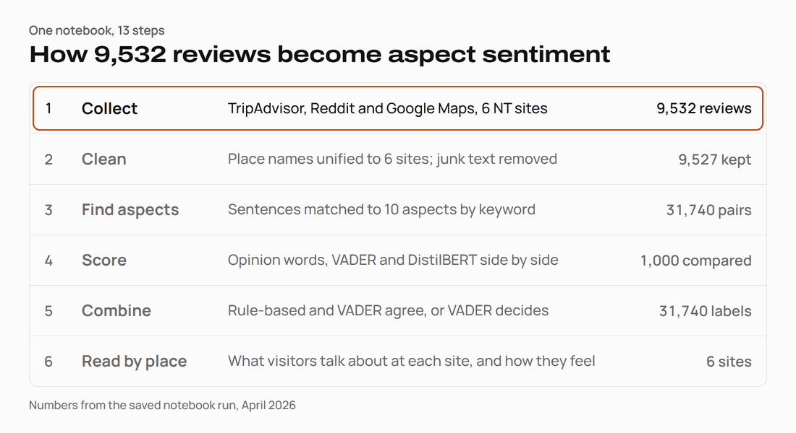

# NT Tourism Reviews: Aspect-Based Sentiment Analysis

[](https://www.python.org/)
[](https://spacy.io/)
[](https://huggingface.co/distilbert/distilbert-base-uncased-finetuned-sst-2-english)
[](LICENSE)

**A notebook that reads 9,532 visitor reviews of six Northern Territory sites and shows what people talk about at each one, and how they feel about it.**



*What visitors talk about at each site (% of extracted aspects). From the notebook's final chart.*

A star rating says how a visit went overall. The review says why.
Take "Overpriced tickets for what you get. The cafe food was mediocre at best."
The notebook finds two aspects in it, Value/Cost and Food/Dining, and marks both negative.
At five of the six sites, scenery and walks are the two biggest topics. At Alice Springs Desert
Park, guides and staff come up as often as walks, and safety more than anywhere else.

- **Ten aspects, written by hand.** Scenery, culture, guides, walks, facilities, weather, cost,
  safety, food and accommodation. Each has seed keywords taken from about 100 real reviews.
- **Three sentiment methods, checked against each other.** Opinion words with negation, VADER and
  DistilBERT label the same 1,000 sentences. The notebook prints where they agree and where they don't.
- **Agreement, not accuracy.** No review was labelled by a person. Read the per-site results as a
  first look, not as ground truth.

Individual project for PRT597 Natural Language Processing, Charles Darwin University, 2026.
Reviews come from public TripAdvisor, Reddit and Google Maps pages; the cleaned data is in the repo.

## Quick start

Nothing to install to see the results. The notebook keeps the outputs of its last run, and every
chart is in [`outputs/`](outputs/). The full write-up is the
[report (PDF)](S382893_Tarik_Bulut_PRT597_ABSA_Report.pdf).

To run it yourself (the saved run used Python 3.13 and PyABSA 2.4.2):

```sh
python -m venv venv
venv\Scripts\activate            # macOS/Linux: source venv/bin/activate
pip install pandas numpy matplotlib seaborn contractions beautifulsoup4 spacy wordcloud \
    scikit-learn nltk transformers torch pyabsa==2.4.2 jupyter
python -m spacy download en_core_web_sm
jupyter notebook ABSA_Tourism_Reviews.ipynb
```

Run the cells top to bottom. The input files are already in `interim/`. Step 9 downloads a 534 MB
PyABSA checkpoint; in the saved run it did not load, and the notebook carried on with DistilBERT.

## How it works

<picture>
  <source media="(prefers-color-scheme: dark)" srcset="docs/img/pipeline-dark.gif">
  
</picture>

1. **Collect:** 4,292 TripAdvisor reviews, 2,853 Reddit comments and 2,387 Google Maps reviews.
2. **Clean:** place names are unified to six sites. Encoding errors, URLs, HTML and emoji are
   removed; contractions are expanded. 5 reviews end up empty, so 9,527 remain.
3. **Find aspects:** spaCy splits each review into sentences. A sentence that contains an aspect's
   keyword is tagged with that aspect. This gives 31,740 aspect–sentence pairs.
4. **Score:** each pair gets a sentiment from opinion words (flipped by "not", "never" and similar),
   from VADER, and, on a 1,000-pair sample, from DistilBERT.
5. **Combine:** when the rule-based label and VADER agree, that label stands. Otherwise VADER decides.
6. **Read by place:** aspect shares and sentiment per site, then checks for bias by source.

<details>
<summary>Each step in the notebook, with its output files</summary>

The notebook `ABSA_Tourism_Reviews.ipynb` has 13 steps.

1. **Environment setup.** Folders `interim/`, `processed/` and `outputs/`.
2. **Loading and exploration.** Reads the three CSVs in `interim/` (columns `source`, `place`,
   `comment`). Charts: `outputs/review_counts_by_source.png`, `outputs/review_length_distributions.png`.
3. **Merging and place names.** A name map turns spellings such as "Kakadu Gunlom Falls" or
   "Tjoritja / West MacDonnell National Park" into six site names.
4. **Gentle cleaning.** Fixes scraping artefacts, removes URLs, HTML and emoji, expands
   contractions. It keeps short reviews, weather talk and strong language, and does not stem or
   remove stop words. Output: `processed/cleaned_reviews.csv` (9,527 rows).
5. **Quality report.** `outputs/cleaned_data_quality_report.png` and
   `outputs/wordclouds_by_place.png`.
6. **Aspect taxonomy.** Ten aspects and 296 seed terms, each with a reason and an example from the
   data.
7. **Rule-based extraction.** Keyword match per sentence, opinion-word count, negation flip.
   Output: `outputs/aspect_extraction_results.csv` (31,740 rows),
   `outputs/rule_based_aspect_extraction.png`.
8. **Annotation sample.** A stratified sample of 183 reviews labelled by the rule-based system:
   `processed/annotated_sample.csv`. Its human-label columns are empty.
9. **Model-based ABSA.** Writes PyABSA train/valid/test files (6,662 / 1,428 / 1,428 samples) to
   `processed/pyabsa_data/`. The pre-trained PyABSA triplet model failed to load, so no PyABSA model
   was trained or used. DistilBERT (`distilbert-base-uncased-finetuned-sst-2-english`, not
   fine-tuned) and VADER score the sentences instead.
10. **Tuning.** DistilBERT confidence thresholds from 0.5 to 0.9, and a smaller keyword set.
11. **Evaluation.** Classification reports, confusion matrices (`outputs/confusion_matrices.png`),
    coverage per site, a 50-sentence review sample and the disagreement patterns.
    Final labels for all pairs: `outputs/model_predictions.csv`.
12. **Ethics.** Source bias, Indigenous cultural sensitivity, privacy and misuse, with numbers.
13. **Summary.** `outputs/final_aspect_sentiment_analysis.png`.

</details>

## Results

| Measure | Value |
|---|---|
| Reviews after cleaning | 9,527 of 9,532 |
| Reviews with at least one aspect | 7,919 (83.1%) |
| Aspect–sentence pairs | 31,740 |
| Final labels | 19,633 positive, 8,289 neutral, 3,818 negative |
| Most mentioned aspects | Scenery/Landscape 7,828, Activities/Walks 6,987 |
| Least mentioned aspect | Safety 845 |
| Safety share of a site's aspects | 7.1% at Alice Springs Desert Park, 1.6% or less elsewhere |

<details>
<summary>Evaluation: how far the three methods agree (1,000 pairs)</summary>

There are no human labels, so VADER serves as the reference.

| Comparison | Agreement | Cohen's kappa |
|---|---|---|
| Rule-based vs VADER | 58.9% | 0.343 |
| DistilBERT vs VADER | 62.9% | 0.281 |
| Rule-based vs DistilBERT | 34.0% | 0.111 |
| All three agree | 31.7% | |

- The rule-based method calls most sentences neutral: 0.97 recall on VADER's neutral, 0.50 on positive.
- DistilBERT has only two classes, so it almost never says neutral (0.02 recall).
- Threshold tuning: 0.9 agreed best with VADER (64.1%). The run kept 0.6 for the DistilBERT labels.
- Keyword scope, on 2,000 reviews: the full set finds an aspect in 82.55% of them, the first 10
  terms per aspect in 67.60%. The full set was kept.
- Coverage per site runs from 77.5% (Kakadu National Park) to 89.3% (Nitmiluk National Park).

</details>

<details>
<summary>Ethics findings and limits</summary>

- **Source bias.** TripAdvisor is about 45% of the data. 70.1% of Google Maps labels and 65.5% of
  TripAdvisor labels are positive.
- **Safety and Alice Springs.** Reddit talk about crime raises the Safety share there. A model could
  carry that stereotype into tourism advice.
- **Indigenous culture.** 2,835 pairs are about cultural experience. Labelling sacred sites and
  Dreamtime stories positive or negative strips context. The notebook proposes human review of
  culturally sensitive content.
- **Privacy.** About 56 mentions of staff by name (a word such as "guide" or "ranger"
  followed by a name). The
  proposed fix is to redact names and report only per site.
- **Limits.** Sarcasm is missed by all three methods. A mixed sentence ("beautiful but hot") gets
  one label for all its aspects. Reddit comments come from 92 subreddits, some off topic.

</details>

<details>
<summary>Files in this repository</summary>

| Path | What it is |
|---|---|
| `ABSA_Tourism_Reviews.ipynb` | The whole pipeline, with saved outputs |
| `interim/` | Input: TripAdvisor, Reddit and Google Maps reviews |
| `processed/cleaned_reviews.csv` | 9,527 cleaned reviews |
| `processed/annotated_sample.csv` | 183-review sample with rule-based labels |
| `processed/pyabsa_data/` | PyABSA-format train/valid/test files |
| `outputs/aspect_extraction_results.csv` | 31,740 aspect–sentence pairs |
| `outputs/model_predictions.csv` | The same pairs with VADER and final labels |
| `outputs/*.png` | The seven charts |
| `S382893_Tarik_Bulut_PRT597_ABSA_Report.pdf` / `.docx` | The report |

</details>

## Licence

[MIT](LICENSE).
